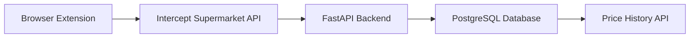

# Product Price Tracker

[](https://github.com/Static7424/product-price-tracker/actions/workflows/ci.yaml)

[](https://codecov.io/gh/Static7424/product-price-tracker)


[](https://github.com/Static7424/product-price-tracker/packages)
[](https://github.com/Static7424/product-price-tracker/blob/main/LICENSE)
[](https://github.com/Static7424/product-price-tracker/commits)

Track grocery prices over time from supermarkets using a browser extension and backend API.

---

## Architecture



---

## Features

- Automatic price retrieval/tracking
- Price history storage
- API for querying price history
- Browser extension integration
- Dockerized backend
- CI with linting and tests

---

## Repository Structure

```
product-price-tracker/
│
├── .github/
│ └── workflows/
│   ├── ci.yaml
│   ├── publish.yaml
│   └── semantic-release.yaml
│
├── database
│ └── init_db.sql
│
├── docker
│ └── Dockerfile
│
├── extension/
│
├── src/
│ │
│ ├── config/
│ │ └── config.py
│ │
│ ├── database/
│ │ └── database.py
│ │
│ ├── models/
│ │ ├── price.py
│ │ └── product.py
│ │
│ ├── routes/
│ │ ├── prices.py
│ │ └── products.py
│ │
│ ├── schemas/
│ │ ├── prices.py
│ │ └── products.py
│ │
│ └── main.py
│
├── tests/
│ ├── conftest.py
│ ├── test_prices.py
│ └── test_products.py
│
├── .env.example
├── .gitignore
├── .releaserc.json
├── docker-compose.yml
├── LICENSE
├── pyproject.toml
├── README.md
└── uv.lock
```

---

## Tech Stack
- **Python 3.13** / FastAPI / SQLAlchemy
- **PostgreSQL**
- **uv** - package manager
- **Docker** - containerization

---

## Local Development

### 1. Configure Environment
```bash
cp .env.example .env
```

### 2. Start Services
```bash
docker compose up --build
```

### 3. Run Backend Tests
```bash
uv run pytest
```

### 4. Run Linting
```bash
uv run ruff check .
```

---

## API Endpoints

| Method | Endpoint | Description |
|--------|----------|-------------|
| POST | `/prices/record` | Record a price for a product_id in the PostGres DB |
| POST | `/products/register` | Register a new product to the PostGres DB |
| GET | `/products/{product_id}` | Get a registered product for a particular product ID |
| GET | `/products/{product_id}/history` | Get the historic prices for a particular product ID |

---

## CI Pipeline

The project uses **GitHub Actions** for:
- Linting
- Unit tests
- Security scanning
- Docker build verification

---

## Roadmap

- Extension popup with price chart
- Historical price analytics
- Price alerts
- Multi-store support
- Scheduled scraping workers
- Shopping list creation

---

## License

MIT